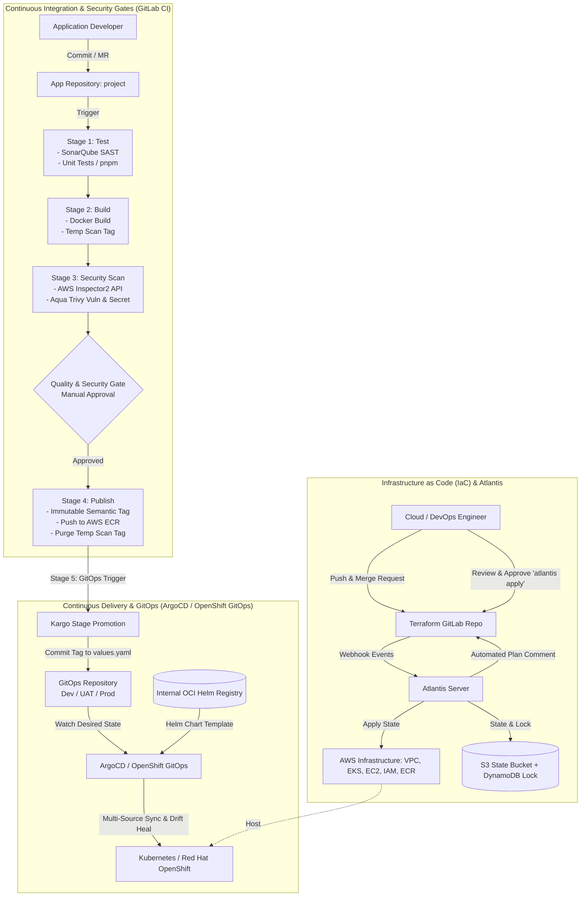

# Project Portfolio: Enterprise End-to-End DevOps CI/CD & GitOps Pipeline

> **Description:** Technical portfolio documentation of an enterprise-grade GitOps-based infrastructure automation and CI/CD delivery platform for backend microservices, leveraging Terraform, Atlantis, GitLab CI, Amazon ECR, AWS Inspector, Aqua Trivy, ArgoCD (OpenShift GitOps), Kargo, and Helm. All application names, internal domains, credentials, and sensitive identifiers have been sanitized into generic placeholders (`project`).

---

## 1. Resume / CV Format (Ready to Copy)

The following concise bullet points are formatted for direct inclusion in CVs, LinkedIn, or engineering portfolios:

```text
Enterprise End-to-End DevOps & GitOps Platform (ArgoCD & Kargo) | github.com/ibnuzamra/end-to-end-devops-pipeline
• Built an enterprise-grade end-to-end DevOps & GitOps platform for backend microservices using Terraform, Atlantis, GitLab CI, Docker, AWS ECR, ArgoCD, Kargo, and Helm.
• Provisioned modular AWS infrastructure (Multi-AZ VPC, EKS, EC2, IAM least privilege, Route53, and S3/DynamoDB state locking) automated via Atlantis GitOps PR workflow.
• Engineered a 6-stage GitLab CI pipeline automating Node.js unit tests, SonarQube SAST, Docker builds, and dual-layer security scanning with AWS Inspector and Aqua Trivy (blocking High/Critical CVEs).
• Implemented multi-stage GitOps delivery using ArgoCD (OpenShift GitOps) and Kargo, automating stage promotion across environments (Dev, UAT, Prod), automated drift healing, and instant rollback.
```

---

## 2. System Architecture & End-to-End Workflow



---

## 3. Core Components & Technical Implementation

### A. Infrastructure as Code (Terraform & Atlantis)
Infrastructure is provisioned and managed declaratively using modular, production-ready Terraform structures, with strictly separated root modules per environment (`dev`, `uat`, `prod`).

1. **State Management & Concurrency Locking:**
   - Remote state is securely stored in Amazon S3 with object versioning and `AES256` server-side encryption.
   - Distributed concurrency locking is enforced via Amazon DynamoDB (`terraform-lock`) to prevent state corruption during concurrent pipeline runs.

2. **Atlantis GitOps Automation (`atlantis.yaml`):**
   - Every Merge Request modifying `**/*.tf` or `*.hcl` triggers an automated webhook to the self-hosted Atlantis server.
   - Atlantis automatically runs `terraform plan` and posts the detailed execution plan and resource diff back as an MR comment.
   - Executing `terraform apply` strictly requires maintainer review approval followed by an authorized `atlantis apply` command comment before changes can be merged.

```yaml
# atlantis.yaml (Sanitized)
version: 3
projects:
  - name: dev
    dir: env/dev
    workspace: default
    autoplan:
      enabled: true
      when_modified: ["**/*.tf", "*.hcl"]
  - name: uat
    dir: env/uat
    workspace: default
    autoplan:
      enabled: true
      when_modified: ["**/*.tf", "*.hcl"]
  - name: prod
    dir: env/prod
    workspace: default
    autoplan:
      enabled: true
      when_modified: ["**/*.tf", "*.hcl"]
```

3. **Reusable EKS Module (`modules/eks/main.tf`):**
```hcl
module "eks_cluster" {
  source          = "terraform-aws-modules/eks/aws"
  version         = "~> 20.0"
  count           = var.enabled ? 1 : 0

  cluster_name    = var.cluster_name
  cluster_version = var.cluster_version
  vpc_id          = var.vpc_id
  subnet_ids      = var.subnet_ids
  enable_irsa     = true

  eks_managed_node_groups = {
    default = {
      instance_types = var.node_instance_types
      min_size       = 1
      max_size       = 3
      desired_size   = 2
    }
  }

  tags = var.tags
}
```

---

### B. Continuous Integration & Multi-Stage Security Pipeline (GitLab CI)
The CI pipeline is architected around a **fail-closed** philosophy and **immutable artifact promotion**:

1. **Test Stage:**
   - Executes **SonarQube SAST** to detect code smells, technical debt, bugs, and static vulnerabilities.
   - Executes automated Node.js 20 unit tests with locked dependencies via `pnpm` (`--frozen-lockfile`).

2. **Build Stage:**
   - Builds an isolated, temporary Docker image tagged as `scan-${CI_PIPELINE_ID}-${CI_JOB_ID}`.
   - Pushes this temporary scan artifact to Amazon ECR strictly for automated vulnerability verification.

3. **Scan Stage (Dual Security Gate):**
   - **AWS Inspector2:** Queries the AWS Inspector API against the pushed ECR image digest. Any findings marked with *CRITICAL* or *HIGH* severity fail the pipeline immediately (*exit 1*).
   - **Aqua Trivy:** Performs client-side image scanning for OS/package CVEs and detected secrets/credential leaks (`--scanners vuln,secret --severity HIGH,CRITICAL --exit-code 1`).

4. **Publish Stage (Gated Immutable Promotion):**
   - Once security gates pass and required manual approval is granted for UAT/Prod, the verified image is promoted with an immutable semantic release tag (e.g., `prod-12`) and pushed to ECR.
   - The ephemeral `scan-*` tag is immediately purged from ECR (`aws ecr batch-delete-image`) to maintain registry hygiene and optimize storage costs.

5. **GitOps Stage:**
   - Automatically notifies and synchronizes the GitOps pipeline, triggering Kargo freight detection and ArgoCD state deployment.

```yaml
# .gitlab-ci.yml (Sanitized Snippet)
stages:
  - test
  - build
  - scan
  - publish
  - gitops
  - cleanup

variables:
  APPNAME: "project"
  REPO: "project-repository"
  ECR_REGISTRY: "${AWS_ACCOUNT_ID}.dkr.ecr.${AWS_DEFAULT_REGION}.amazonaws.com"
  HELM_CHART_URL: "oci://registry.internal.corp"

# Static Code Analysis
sonarqube-check:
  stage: test
  script:
    - /opt/sonar-scanner/bin/sonar-scanner
        -Dsonar.projectKey=${REPO}-${APPNAME}
        -Dsonar.sources=.
        -Dsonar.host.url=${SONAR_URL}
        -Dsonar.login=${SONAR_TOKEN}

# Automated Unit Testing
unit-test:
  stage: test
  script:
    - corepack enable
    - corepack prepare pnpm@latest --activate
    - pnpm install --frozen-lockfile
    - pnpm test

# Container Security Scanning (Trivy & AWS Inspector)
trivy-scan:
  stage: scan
  script:
    - docker run --rm -e TRIVY_USERNAME=AWS -e TRIVY_PASSWORD \
        -v trivy-cache:/root/.cache/ ${TRIVY_IMAGE} image \
        --scanners vuln,secret \
        --exit-code 1 --severity HIGH,CRITICAL --ignore-unfixed "${SCAN_IMAGE}"

# Controlled Release Promotion
publish-prod:
  stage: publish
  when: manual
  script:
    - docker pull "${SCAN_IMAGE}"
    - docker tag "${SCAN_IMAGE}" "${ECR_REGISTRY}/${REPO}/${APPNAME}:${GENERATED_IMAGE_TAG}"
    - docker push "${ECR_REGISTRY}/${REPO}/${APPNAME}:${GENERATED_IMAGE_TAG}"
    - aws ecr batch-delete-image --repository-name "${REPO}/${APPNAME}" --image-ids imageTag="${SCAN_TAG}"
```

---

### C. GitOps & Continuous Delivery (ArgoCD & Helm)
Application deployments to Kubernetes / Red Hat OpenShift are managed declaratively using GitOps principles powered by ArgoCD.

1. **Multi-Source Application Pattern:**
   - **Source 1 (OCI Helm Chart):** Consumes standardized base Helm charts from an internal OCI Registry (`oci://registry.internal.corp`).
   - **Source 2 (Git Repository):** Retrieves environment-specific deployment values (`values.yaml`) directly from the GitOps Git repository.

2. **Automated Reconciliation & Drift Healing:**
   - `automated.prune = true`: Automatically purges orphaned Kubernetes resources in the cluster when removed from Git.
   - `automated.selfHeal = true`: Prevents configuration drift caused by manual in-cluster interventions by continuously reverting cluster state back to the Git source of truth.

```yaml
# ArgoCD Application Manifest (Sanitized: uat/applications/project.yaml)
apiVersion: argoproj.io/v1alpha1
kind: Application
metadata:
  name: project
  namespace: openshift-gitops
spec:
  project: project

  sources:
    # 1. Base Helm Chart from OCI Registry
    - repoURL: registry.internal.corp/project
      chart: project
      targetRevision: "1.0.1-uat"
      helm:
        valueFiles:
          - $values/project/uat/project/values.yaml

    # 2. Desired State Values from Git Repository
    - repoURL: git@gitlab.internal.corp:devops/gitops.git
      targetRevision: master
      ref: values

  destination:
    server: https://kubernetes.default.svc
    namespace: project-uat

  syncPolicy:
    automated:
      prune: true
      selfHeal: true
    syncOptions:
      - CreateNamespace=true
```

```yaml
# values.yaml (Sanitized: uat/project/values.yaml)
image:
  repository: 123456789012.dkr.ecr.ap-southeast-3.amazonaws.com/project-repository/project
  pullPolicy: Always
  tag: "uat-42"
podAnnotations:
  cluster-autoscaler.kubernetes.io/safe-to-evict: "true"
```

3. **Multi-Environment Promotion via Kargo (akuity.io/kargo):**
   - **Warehouse Discovery:** Kargo `Warehouse` monitors Amazon ECR every 30 seconds to discover newly published, verified immutable image tags (`prod-*`), packaging them into traceable delivery units (*Freight*).
   - **Stage Promotion Automation:** Kargo `Stage` controls promotion workflows across environments (`dev` → `uat` → `prod`). When a promotion is triggered (automatically or via gated manual approval), Kargo executes a declarative `promotionTemplate`:
     1. `git-clone`: Clones the GitOps repository into an ephemeral runner workspace.
     2. `yaml-update`: Programmatically updates the `image.tag` key inside the target environment's `values.yaml` file without disturbing formatting or comments.
     3. `git-commit` & `git-push`: Commits the desired state mutation with a standardized audit trail message (`chore(gitops): update prod project image tag`) and pushes to the Git repository.
   - **Zero-Drift Execution:** ArgoCD detects the new Git commit and instantly reconciles the target Kubernetes / OpenShift cluster state without manual intervention.

```yaml
# Kargo Warehouse & Stage Manifest Snippet (gitops/kargo/)
apiVersion: kargo.akuity.io/v1alpha1
kind: Warehouse
metadata:
  name: project-warehouse
  namespace: kargo-project
spec:
  interval: 30s
  freightCreationPolicy: Automatic
  subscriptions:
    - image:
        repoURL: 123456789012.dkr.ecr.ap-southeast-3.amazonaws.com/project-repository/project
        imageSelectionStrategy: NewestBuild
        strictSemvers: true
        allowTagsRegexes:
          - ^(prod-[0-9]+|[0-9]+([.][0-9]+){2,3}|latest-prod|latest)$
---
apiVersion: kargo.akuity.io/v1alpha1
kind: Stage
metadata:
  name: prod-project
  namespace: kargo-project
spec:
  requestedFreight:
    - origin:
        kind: Warehouse
        name: project-warehouse
      sources:
        direct: true
  promotionTemplate:
    spec:
      vars:
        - name: image
          value: 123456789012.dkr.ecr.ap-southeast-3.amazonaws.com/project-repository/project
      steps:
        - uses: git-clone
          config:
            repoURL: git@gitlab.internal.corp:devops/gitops.git
            checkout:
              - branch: master
                path: ./repo
        - uses: yaml-update
          as: update-image
          config:
            path: ./repo/gitops/values/prod/values.yaml
            updates:
              - key: image.tag
                value: ${{ imageFrom(vars.image).Tag }}
        - uses: git-commit
          config:
            path: ./repo
            message: "chore(gitops): update prod project image tag"
        - uses: git-push
          config:
            path: ./repo
```

---

## 4. Key Highlights & Business Value

| Category | Technical Solution | Impact & Engineering Value |
|---|---|---|
| **Security & Compliance** | Dual security scanning (AWS Inspector + Trivy) & SonarQube SAST | Prevents deployment of vulnerable images and credential leaks into staging and production environments early in the delivery lifecycle. |
| **Auditability & Traceability** | Atlantis GitOps & Immutable Image Tagging | 100% of infrastructure mutations and application deployments are captured in immutable Git commit logs and Merge Request approval trails. |
| **Reliability & Zero Downtime** | ArgoCD Automated Sync, Self-Healing, & Prune | Eliminates configuration drift and guarantees that live cluster state matches the desired state in Git repositories continuously. |
| **Velocity & Efficiency** | Multi-source Helm charts & Kargo automated promotion | Accelerates multi-stage release lead times (Dev → UAT → Prod) with precise gated approval controls and automated rollback capabilities. |
