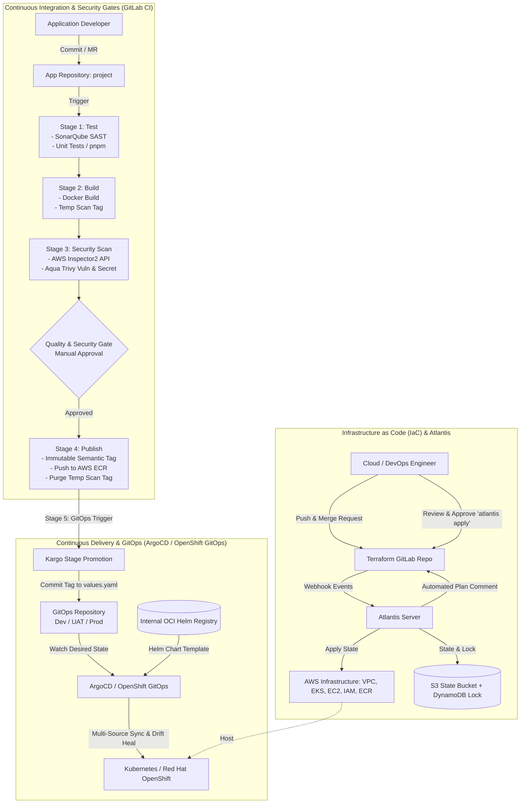

# Project Portfolio: Enterprise End-to-End DevOps CI/CD & GitOps Pipeline

> **Deskripsi:** Portofolio teknis implementasi otomatisasi infrastruktur dan pipeline CI/CD berbasis GitOps untuk project backend enterprise, menggunakan Terraform, Atlantis, GitLab CI, AWS ECR, AWS Inspector, Trivy, ArgoCD (OpenShift GitOps), dan Helm. Seluruh nama aplikasi, domain internal, credential, dan identitas rahasia telah disanitasi menjadi placeholder generik (`project`).

---

## 1. Resume / CV Format

Format ringkas berikut siap disalin langsung ke CV / LinkedIn / Resume:

```text
Enterprise End-to-End DevOps & GitOps Platform (ArgoCD & Kargo) | github.com/ibnuzamra/end-to-end-devops-pipeline
• Built an enterprise-grade end-to-end DevOps & GitOps platform for backend microservices using Terraform, Atlantis, GitLab CI, Docker, AWS ECR, ArgoCD, Kargo, and Helm.
• Provisioned modular AWS infrastructure (Multi-AZ VPC, EKS, EC2, IAM least privilege, Route53, and S3/DynamoDB state locking) automated via Atlantis GitOps PR workflow.
• Engineered a 6-stage GitLab CI pipeline automating Node.js unit tests, SonarQube SAST, Docker builds, and dual-layer security scanning with AWS Inspector and Aqua Trivy (blocking High/Critical CVEs).
• Implemented multi-stage GitOps delivery using ArgoCD (OpenShift GitOps) and Kargo, automating stage promotion across environments (Dev, UAT, Prod), automated drift healing, and instant rollback.
```

---

## 2. Arsitektur Solusi (System Architecture)



---

## 3. Komponen Utama & Implementasi Teknis

### A. Infrastructure as Code (Terraform & Atlantis)
Infrastruktur dikelola secara deklaratif menggunakan modul Terraform yang terstruktur rapi, dengan pemisahan *root module* per environment (`dev`, `uat`, `prod`).

1. **State Management & Locking:**
   - State disimpan di AWS S3 dengan versioning dan enkripsi `AES256`.
   - Concurrency locking dikontrol menggunakan DynamoDB (`terraform-lock`).

2. **Automasi GitOps Atlantis (`atlantis.yaml`):**
   - Setiap pembuatan Merge Request pada file `**/*.tf` atau `*.hcl` memicu webhook ke server Atlantis.
   - Atlantis secara otomatis menjalankan `terraform plan` dan mengirimkan hasil *diff* ke komentar Merge Request.
   - Eksekusi `terraform apply` diwajibkan melalui komentar `atlantis apply` setelah mendapat *approval* dari Maintainer.

```yaml
# atlantis.yaml (Sanitized)
version: 3
projects:
  - name: dev
    dir: env/dev
    workspace: default
    autoplan:
      enabled: true
      when_modified: ["**/*.tf", "*.hcl"]
  - name: uat
    dir: env/uat
    workspace: default
    autoplan:
      enabled: true
      when_modified: ["**/*.tf", "*.hcl"]
  - name: prod
    dir: env/prod
    workspace: default
    autoplan:
      enabled: true
      when_modified: ["**/*.tf", "*.hcl"]
```

3. **Modul EKS Reusable (`modules/eks/main.tf`):**
```hcl
module "eks_cluster" {
  source          = "terraform-aws-modules/eks/aws"
  version         = "~> 20.0"
  count           = var.enabled ? 1 : 0

  cluster_name    = var.cluster_name
  cluster_version = var.cluster_version
  vpc_id          = var.vpc_id
  subnet_ids      = var.subnet_ids
  enable_irsa     = true

  eks_managed_node_groups = {
    default = {
      instance_types = var.node_instance_types
      min_size       = 1
      max_size       = 3
      desired_size   = 2
    }
  }

  tags = var.tags
}
```

---

### B. Continuous Integration & Multi-Stage Security Pipeline (GitLab CI)
Pipeline CI dirancang dengan filosofi **fail-closed** dan **immutable artifact promotion**:

1. **Test Stage:**
   - Menjalankan **SonarQube SAST** untuk mendeteksi *code smell*, bug, dan kerentanan statis.
   - Menjalankan unit tests Node.js 20 menggunakan `pnpm` dengan dependensi terkunci (`--frozen-lockfile`).

2. **Build Stage:**
   - Membuat image Docker sementara dengan format tag: `scan-${CI_PIPELINE_ID}-${CI_JOB_ID}`.
   - Image sementara ini didorong ke Amazon ECR hanya untuk keperluan validasi keamanan.

3. **Scan Stage (Dual Security Layer):**
   - **AWS Inspector2:** Memanggil API AWS Inspector untuk memeriksa hasil analisis CVE pada digest image ECR. Jika ditemukan kerentanan dengan tingkat *CRITICAL* atau *HIGH*, pipeline otomatis dibatalkan (*exit 1*).
   - **Aqua Trivy:** Memindai image secara lokal untuk mendeteksi celah CVE OS/package library serta kebocoran credential/secret (`--scanners vuln,secret --severity HIGH,CRITICAL --exit-code 1`).

4. **Publish Stage (Gated Promotion):**
   - Setelah scan lolos dan disetujui (manual approval untuk UAT/Prod), image sementara ditarik, diberi tag semantik baru yang *immutable* (misal `prod-12`), dan di-push ke ECR.
   - Tag sementara `scan-*` langsung dihapus dari ECR (`aws ecr batch-delete-image`) guna menjaga kebersihan registry.

5. **GitOps Stage:**
   - Pipeline mengintegrasikan update ke repository GitOps secara otomatis dengan mendeteksi commit promosi Kargo pada file `values.yaml`.

```yaml
# .gitlab-ci.yml (Sanitized Snippet)
stages:
  - test
  - build
  - scan
  - publish
  - gitops
  - cleanup

variables:
  APPNAME: "project"
  REPO: "project-repository"
  ECR_REGISTRY: "${AWS_ACCOUNT_ID}.dkr.ecr.${AWS_DEFAULT_REGION}.amazonaws.com"
  HELM_CHART_URL: "oci://registry.internal.corp"

# Static Code Analysis
sonarqube-check:
  stage: test
  script:
    - /opt/sonar-scanner/bin/sonar-scanner
        -Dsonar.projectKey=${REPO}-${APPNAME}
        -Dsonar.sources=.
        -Dsonar.host.url=${SONAR_URL}
        -Dsonar.login=${SONAR_TOKEN}

# Automated Unit Testing
unit-test:
  stage: test
  script:
    - corepack enable
    - corepack prepare pnpm@latest --activate
    - pnpm install --frozen-lockfile
    - pnpm test

# Container Security Scanning (Trivy & AWS Inspector)
trivy-scan:
  stage: scan
  script:
    - docker run --rm -e TRIVY_USERNAME=AWS -e TRIVY_PASSWORD \
        -v trivy-cache:/root/.cache/ ${TRIVY_IMAGE} image \
        --scanners vuln,secret \
        --exit-code 1 --severity HIGH,CRITICAL --ignore-unfixed "${SCAN_IMAGE}"

# Controlled Release Promotion
publish-prod:
  stage: publish
  when: manual
  script:
    - docker pull "${SCAN_IMAGE}"
    - docker tag "${SCAN_IMAGE}" "${ECR_REGISTRY}/${REPO}/${APPNAME}:${GENERATED_IMAGE_TAG}"
    - docker push "${ECR_REGISTRY}/${REPO}/${APPNAME}:${GENERATED_IMAGE_TAG}"
    - aws ecr batch-delete-image --repository-name "${REPO}/${APPNAME}" --image-ids imageTag="${SCAN_TAG}"
```

---

### C. GitOps & Continuous Delivery (ArgoCD & Helm)
Deployment ke runtime Kubernetes / Red Hat OpenShift menggunakan pola deklaratif GitOps dengan controller ArgoCD.

1. **Multi-Source Application Pattern:**
   - **Source 1 (OCI Helm Chart):** Mengambil base Helm chart terstandarisasi dari OCI Registry internal (`oci://registry.internal.corp`).
   - **Source 2 (Git Repository):** Mengambil konfigurasi spesifik environment (`values.yaml`) dari Git repository GitOps.

2. **Automated Reconciliation & Drift Healing:**
   - `automated.prune = true`: Menghapus resource di cluster yang sudah dihapus dari Git.
   - `automated.selfHeal = true`: Mencegah perubahan manual (*configuration drift*) langsung pada cluster dengan mengembalikan kondisi sesuai Git.

```yaml
# ArgoCD Application Manifest (Sanitized: uat/applications/project.yaml)
apiVersion: argoproj.io/v1alpha1
kind: Application
metadata:
  name: project
  namespace: openshift-gitops
spec:
  project: project

  sources:
    # 1. Base Helm Chart dari OCI Registry
    - repoURL: registry.internal.corp/project
      chart: project
      targetRevision: "1.0.1-uat"
      helm:
        valueFiles:
          - $values/project/uat/project/values.yaml

    # 2. Desired State Values dari Git Repository
    - repoURL: git@gitlab.internal.corp:devops/gitops.git
      targetRevision: master
      ref: values

  destination:
    server: https://kubernetes.default.svc
    namespace: project-uat

  syncPolicy:
    automated:
      prune: true
      selfHeal: true
    syncOptions:
      - CreateNamespace=true
```

```yaml
# values.yaml (Sanitized: uat/project/values.yaml)
image:
  repository: 123456789012.dkr.ecr.ap-southeast-3.amazonaws.com/project-repository/project
  pullPolicy: Always
  tag: "uat-42"
podAnnotations:
  cluster-autoscaler.kubernetes.io/safe-to-evict: "true"
```

3. **Multi-Environment Promotion via Kargo (akuity.io/kargo):**
   - **Warehouse Discovery:** Kargo `Warehouse` memantau Amazon ECR setiap 30 detik untuk mendeteksi *immutable image tags* baru (`prod-*`) yang telah lolos uji security gates, membentuk unit delivery (*Freight*).
   - **Stage Promotion Automation:** Kargo `Stage` mengontrol alur promosi antar-environment (`dev` → `uat` → `prod`). Saat promosi dipicu, Kargo mengeksekusi *promotionTemplate*:
     1. `git-clone`: Clone repository GitOps ke workspace runner.
     2. `yaml-update`: Mengubah nilai `image.tag` pada file `values.yaml` environment terkait secara presisi tanpa merusak struktur file.
     3. `git-commit` & `git-push`: Mendorong commit perubahan desired state ke Git dengan audit message terstandarisasi.
   - **Zero-Drift Execution:** ArgoCD mendeteksi commit baru di Git repository dan merekonsiliasi state cluster Kubernetes / OpenShift secara instan tanpa intervensi manual.

```yaml
# Kargo Warehouse & Stage Manifest Snippet (gitops/kargo/)
apiVersion: kargo.akuity.io/v1alpha1
kind: Warehouse
metadata:
  name: project-warehouse
  namespace: kargo-project
spec:
  interval: 30s
  freightCreationPolicy: Automatic
  subscriptions:
    - image:
        repoURL: 123456789012.dkr.ecr.ap-southeast-3.amazonaws.com/project-repository/project
        imageSelectionStrategy: NewestBuild
        strictSemvers: true
        allowTagsRegexes:
          - ^(prod-[0-9]+|[0-9]+([.][0-9]+){2,3}|latest-prod|latest)$
---
apiVersion: kargo.akuity.io/v1alpha1
kind: Stage
metadata:
  name: prod-project
  namespace: kargo-project
spec:
  requestedFreight:
    - origin:
        kind: Warehouse
        name: project-warehouse
      sources:
        direct: true
  promotionTemplate:
    spec:
      vars:
        - name: image
          value: 123456789012.dkr.ecr.ap-southeast-3.amazonaws.com/project-repository/project
      steps:
        - uses: git-clone
          config:
            repoURL: git@gitlab.internal.corp:devops/gitops.git
            checkout:
              - branch: master
                path: ./repo
        - uses: yaml-update
          as: update-image
          config:
            path: ./repo/gitops/values/prod/values.yaml
            updates:
              - key: image.tag
                value: ${{ imageFrom(vars.image).Tag }}
        - uses: git-commit
          config:
            path: ./repo
            message: "chore(gitops): update prod project image tag"
        - uses: git-push
          config:
            path: ./repo
```

---

## 4. Key Highlights & Business Value

| Kategori | Solusi Teknis | Dampak / Manfaat |
|---|---|---|
| **Security & Compliance** | Dual security scanning (AWS Inspector + Trivy) & SonarQube SAST | Mencegah deployment *vulnerable images* dan *secret leaks* sejak dini ke environment staging/production. |
| **Auditability & Traceability** | Atlantis GitOps & Immutable Image Tagging | 100% perubahan infrastruktur dan deployment terekam dalam *Git commit log* dan *merge request approval trail*. |
| **Reliability & Zero Downtime** | ArgoCD Automated Sync, Self-Healing, & Prune | Mengeliminasi *configuration drift* dan memastikan state cluster selalu identik dengan Git repository. |
| **Velocity & Efficiency** | Multi-source Helm charts & Kargo automated promotion | Mempersingkat waktu rilis antar-environment (Dev → UAT → Prod) dengan pengawalan manual approval yang presisi. |
